# 🧩 py_jdownloader_clicknload_forward_proxy

A lightweight local **Click’n’Load proxy** for JDownloader that emulates the local listener and forwards requests to a remote (LAN or Docker) JDownloader instance.  
Perfect for setups where your browser and JDownloader no longer share the same host.

---

## 🧠 Problem

Jdownloader2 is a Downloadmanager you can run on your machine or put into a [Docker container using jlesage/docker-jdownloader-2](https://github.com/jlesage/docker-jdownloader-2).
If you choose to run it remotely, your User Experience is reduced:

1. Click’n’Load is not available locally anymore, browser extensions and port forwardings might generate **CORS** or connection errors in your Browsers Debugging Network tab.
2. Simple pasting links via Clipboard now involves several steps and web-vnc.

---

## 💡 Solution

Run this minimalistic Python proxy locally Works seamlessly with [1] container image.
It has 2 functions:

1. It mimics JDownloader’s Click’n’Load listener and forwards all requests to your LAN or Docker instance instead.
   - Browser extensions still work  
   - You can turn off your workstation  
   - The NAS does all the heavy lifting
2. Pasting URLs to the Terminal will forward them using the API

## Traditional Workflow

```mermaid
flowchart LR

U[User]
subgraph W[Workstation - always on]
   B[Browser] -- click-n-load<br />✅<br />same IP --> J[JDownLoader]
end

J -- transfer big files --> S

subgraph N[NAS]
S[Storage]
end
U <--> B
```



## Workflow after moving JDownloader


## Proxy Workflow


## TODO

- automatically start Download if all mirrors are online
- automatically paste Links from Download sites when found in ClipBoard

---

## ⚙️ Configuration

### Inside the script

you can adjust your target server:

```python
TARGET_IP = "192.168.0.201"  # where your JDownloader is running
LISTEN_PORT = 9666  # local port to listen on
TARGET_PORT_CLICKNLOAD = 9666  # usually same as LISTEN_PORT
TARGET_PORT_API = 3128  # the depricated API port (only of you want to paste via clipboard)

```

### for the remote JDownloader2 instance

You need to open Port 9666 for CLickNLoad and 


## ❤️ Acknowledgements

- [jlesage] — for making it easy to run JDownloader in Docker
- your fellow AI

## links

[jlesage]: https://github.com/jlesage/docker-jdownloader-2